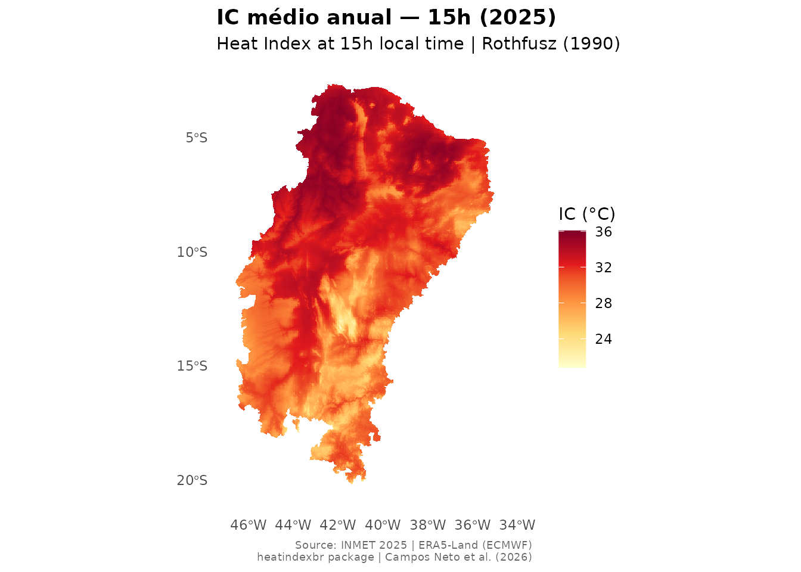

# Primeiros passos com o heatindexbr

O `heatindexbr` disponibiliza rasters do Índice de Calor (Rothfusz 1990)
com resolução de ~1 km para os 1.477 municípios do Semiárido Brasileiro
oficial (Res. CONDEL/SUDENE 176/2024). Esta vignette apresenta o fluxo
de uso principal: busca → download → extração → visualização.

## Instalação

``` r

# Instale pelo GitHub
remotes::install_github("antcneto/heatindexbr")
```

``` r

library(heatindexbr)
```

## Quais dados estão disponíveis?

Use
[`hi_available()`](https://antcneto.github.io/heatindexbr/reference/hi_available.md)
para ver os anos, resoluções e horários sinóticos disponíveis:

``` r

hi_available()
#> ℹ Repository: <https://doi.org/10.5281/zenodo.20942619>
#> ℹ Use `hi_download()` to access available products.
#>   year resolution                             hours         status
#> 1 2025     annual                00h, 09h, 15h, 21h      available
#> 2 2025    monthly      00h, 09h, 15h, 21h (Jan-Dec) in preparation
#> 3 2025      daily 00h, 09h, 15h, 21h (all 365 days) in preparation
#> 4 2025     hourly                         all hours in preparation
```

## Busca de municípios

Os nomes de municípios no `heatindexbr` seguem o padrão IBGE:
**maiúsculas sem acentos**. Use
[`hi_search()`](https://antcneto.github.io/heatindexbr/reference/hi_search.md)
para encontrar o nome correto:

``` r

# Busca parcial, sem distinção de maiúsculas
hi_search("Mossoro", state = "RN")
#>     code_muni name_muni abbrev_state
#> 500   2408003   MOSSORO           RN
hi_search("Campina Grande", state = "PB")
#>     code_muni      name_muni abbrev_state
#> 904   2504009 CAMPINA GRANDE           PB
```

> **Atenção:** sempre utilize o valor da coluna `name_muni` retornado
> por
> [`hi_search()`](https://antcneto.github.io/heatindexbr/reference/hi_search.md)
> ao chamar
> [`hi_municipality()`](https://antcneto.github.io/heatindexbr/reference/hi_municipality.md).
> Por exemplo, `"MOSSORO"` e não `"Mossoró"`. Esta é uma limitação do
> padrão de nomenclatura do IBGE; a função
> [`hi_search()`](https://antcneto.github.io/heatindexbr/reference/hi_search.md)
> existe exatamente para facilitar essa conversão.

## Extração do Índice de Calor para um município

[`hi_municipality()`](https://antcneto.github.io/heatindexbr/reference/hi_municipality.md)
baixa o raster (armazenado em cache na primeira vez), recorta para o
limite municipal e retorna estatísticas resumidas com classificação
NOAA:

``` r

resultado <- hi_municipality("MOSSORO", state = "RN", hour = "15h")
resultado
#>   code_muni name_muni abbrev_state     mean hour year resolution
#> 1   2408003   MOSSORO           RN 34.22216  15h 2025     annual
#>        noaa_class
#> 1 Extreme caution
```

A coluna `noaa_class` utiliza os limites oficiais da escala NOAA:

| Classe          | IC      | Risco                                   |
|-----------------|---------|-----------------------------------------|
| Sem cautela     | \< 27°C | Baixo                                   |
| Cautela         | 27–32°C | Fadiga com exposição prolongada         |
| Cautela extrema | 32–41°C | Cãibras ou exaustão por calor possíveis |
| Perigo          | 41–54°C | Exaustão por calor provável             |
| Perigo extremo  | \> 54°C | Insolação iminente                      |

Para obter todos os quatro horários sinóticos de uma vez, use
`hour = NULL`:

``` r

hi_municipality("MOSSORO", state = "RN", hour = NULL)
```

## Download e visualização do raster completo

[`hi_download()`](https://antcneto.github.io/heatindexbr/reference/hi_download.md)
retorna um `SpatRaster` (pacote terra). O raster é baixado uma única vez
e reutilizado do cache nas chamadas seguintes:

``` r

r <- hi_download(year = 2025, hour = "15h")
#> ✔ Using cached:
#> /home/runner/.cache/R/heatindexbr/IC_2025_annual_all.tif
r
#> class       : SpatRaster
#> size        : 1983, 1299, 1  (nrow, ncol, nlyr)
#> resolution  : 999.7408, 999.9794  (x, y)
#> extent      : 5799573, 7098237, 7714924, 9697883  (xmin, xmax, ymin, ymax)
#> coord. ref. : SIRGAS 2000 / Brazil Polyconic (EPSG:5880)
#> source      : IC_2025_annual_all.tif
#> name        :    IC_15h
#> min value   : 20.407417
#> max value   : 36.131783
```

Passe o raster diretamente para
[`hi_plot()`](https://antcneto.github.io/heatindexbr/reference/hi_plot.md)
para gerar o mapa:

``` r

hi_plot(r,
        title = "IC médio anual — 15h (2025)",
        hour  = "15h",
        year  = 2025)
#> <SpatRaster> resampled to 501000 cells.
```



## Extração para polígono personalizado

Se você tiver um objeto `sf` próprio (bacia hidrográfica, limite
estadual, área de estudo), use
[`hi_shape()`](https://antcneto.github.io/heatindexbr/reference/hi_shape.md):

``` r

library(sf)

minha_area <- st_read("minha_area.gpkg")

resultado <- hi_shape(minha_area, hour = "15h")
resultado$stats   # data.frame com mean, min, max, noaa_class
resultado$raster  # SpatRaster recortado
```

## Nota técnica sobre o raster

O raster base (`IC_2025_annual_all.tif`) está em **EPSG:5880** (SIRGAS
2000 / Brazil Polyconic) — o SRC projetado adequado para o Brasil. A
versão em WGS84 possui um artefato de recorte na borda leste e não deve
ser utilizada. Consulte
[`vignette("methodology")`](https://antcneto.github.io/heatindexbr/articles/methodology.md)
para detalhes completos sobre o método de interpolação.

## Como citar

Se você utilizar o `heatindexbr` em sua pesquisa, por favor cite:

``` r

citation("heatindexbr")
```

Ou cite diretamente o conjunto de dados no Zenodo:

> Campos Neto, A. (2025). *heatindexbr: rasters de Índice de Calor para
> o Semiárido Brasileiro* (v0.1.0). Zenodo.
> <https://doi.org/10.5281/zenodo.20942619>
