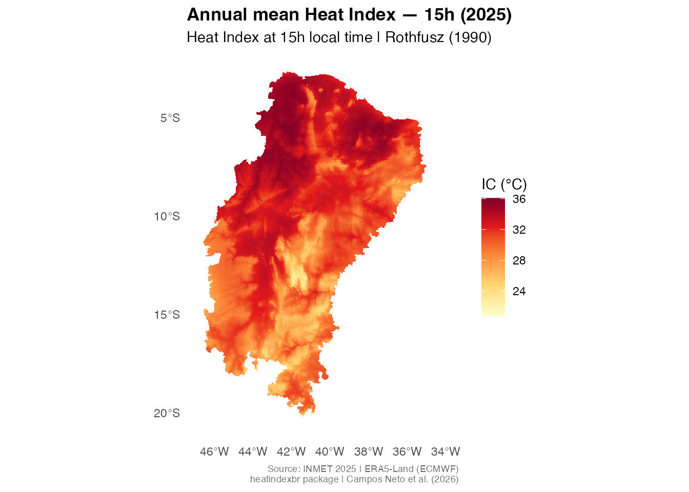

# Getting started with heatindexbr

`heatindexbr` provides spatially interpolated Heat Index (Rothfusz 1990)
rasters at ~1 km resolution for the 1,477 municipalities of Brazil’s
official Semiarid region (CONDEL/SUDENE Resolution 176/2024). This
vignette walks through the core workflow: search → download → extract →
plot.

## Installation

``` r

# Install from GitHub
remotes::install_github("antcneto/heatindexbr")
```

``` r

library(heatindexbr)
```

## What data is available?

Use
[`hi_available()`](https://antcneto.github.io/heatindexbr/reference/hi_available.md)
to see the years, resolutions, and synoptic hours currently distributed:

``` r

hi_available()
#> ℹ Repository: <https://doi.org/10.5281/zenodo.20942619>
#> ℹ Use `hi_download()` to access available products.
#>   year resolution                             hours         status
#> 1 2025     annual                00h, 09h, 15h, 21h      available
#> 2 2025    monthly      00h, 09h, 15h, 21h (Jan-Dec) in preparation
#> 3 2025      daily 00h, 09h, 15h, 21h (all 365 days) in preparation
#> 4 2025     hourly                         all hours in preparation
```

## Searching for municipalities

Municipality names in `heatindexbr` follow the IBGE convention:
**uppercase without accents**. Use
[`hi_search()`](https://antcneto.github.io/heatindexbr/reference/hi_search.md)
to find the correct name:

``` r

# Case-insensitive partial match
hi_search("Mossoro", state = "RN")
#>     code_muni name_muni abbrev_state
#> 500   2408003   MOSSORO           RN
hi_search("Campina Grande", state = "PB")
#>     code_muni      name_muni abbrev_state
#> 904   2504009 CAMPINA GRANDE           PB
```

> **Important:** Always use the `name_muni` value returned by
> [`hi_search()`](https://antcneto.github.io/heatindexbr/reference/hi_search.md)
> when calling
> [`hi_municipality()`](https://antcneto.github.io/heatindexbr/reference/hi_municipality.md).
> For example, `"MOSSORO"`, not `"Mossoró"`.

## Extracting Heat Index for a municipality

[`hi_municipality()`](https://antcneto.github.io/heatindexbr/reference/hi_municipality.md)
downloads the raster (cached on first use), crops it to the municipality
boundary, and returns summary statistics with NOAA classification:

``` r

result <- hi_municipality("MOSSORO", state = "RN", hour = "15h")
result
#>   code_muni name_muni abbrev_state     mean hour year resolution
#> 1   2408003   MOSSORO           RN 34.22471  15h 2025     annual
#>        noaa_class
#> 1 Extreme caution
```

The `noaa_class` column uses the standard NOAA Heat Index thresholds:

| Class           | IC range | Risk                               |
|-----------------|----------|------------------------------------|
| No caution      | \< 27°C  | Low                                |
| Caution         | 27–32°C  | Fatigue with prolonged exposure    |
| Extreme caution | 32–41°C  | Heat cramps or exhaustion possible |
| Danger          | 41–54°C  | Heat exhaustion likely             |
| Extreme danger  | \> 54°C  | Heat stroke imminent               |

You can retrieve all four synoptic hours at once by leaving
`hour = NULL`:

``` r

hi_municipality("MOSSORO", state = "RN", hour = NULL)
```

## Downloading and plotting the full raster

[`hi_download()`](https://antcneto.github.io/heatindexbr/reference/hi_download.md)
returns a `SpatRaster` (terra package). The raster is downloaded once
and cached in your user data directory:

``` r

r <- hi_download(year = 2025, hour = "15h")
#> ✔ Using cached:
#>   /Users/antcneto/Library/Caches/org.R-project.R/R/heatindexbr/IC_2025_annual_all.tif
r
#> class       : SpatRaster 
#> size        : 1983, 1299, 1  (nrow, ncol, nlyr)
#> resolution  : 999.7408, 999.9794  (x, y)
#> extent      : 5799573, 7098237, 7714924, 9697883  (xmin, xmax, ymin, ymax)
#> coord. ref. : SIRGAS 2000 / Brazil Polyconic (EPSG:5880) 
#> source      : IC_2025_annual_all.tif 
#> name        :   IC_15h 
#> min value   : 20.40742 
#> max value   : 36.13178
```

Pass the raster directly to
[`hi_plot()`](https://antcneto.github.io/heatindexbr/reference/hi_plot.md)
for a ready-to-use map:

``` r

hi_plot(r,
        title = "Annual mean Heat Index — 15h (2025)",
        hour  = "15h",
        year  = 2025)
#> <SpatRaster> resampled to 501000 cells.
```



## Extracting for a custom polygon

If you have your own `sf` object (e.g. a watershed, a state boundary, or
a study area), use
[`hi_shape()`](https://antcneto.github.io/heatindexbr/reference/hi_shape.md):

``` r

library(sf)

# Example: using your own polygon
my_area <- st_read("my_area.gpkg")

result <- hi_shape(my_area, hour = "15h")
result$stats   # data.frame with mean, min, max, noaa_class
result$raster  # clipped SpatRaster
```

## Technical note on the raster

The underlying raster (`IC_2025_annual_all.tif`) is stored in
**EPSG:5880** (SIRGAS 2000 / Brazil Polyconic) — the appropriate
projected CRS for Brazil. Do not use the WGS84 version, which has a
clipping artifact on the eastern boundary. See
[`vignette("methodology")`](https://antcneto.github.io/heatindexbr/articles/methodology.md)
for full details on the interpolation method.

## Citation

If you use `heatindexbr` in your research, please cite:

``` r

citation("heatindexbr")
```

Or cite the Zenodo dataset directly:

> Campos Neto, A. (2025). *heatindexbr: Heat Index rasters for Brazil’s
> Semiarid region* (v0.1.0). Zenodo.
> <https://doi.org/10.5281/zenodo.20942619>
