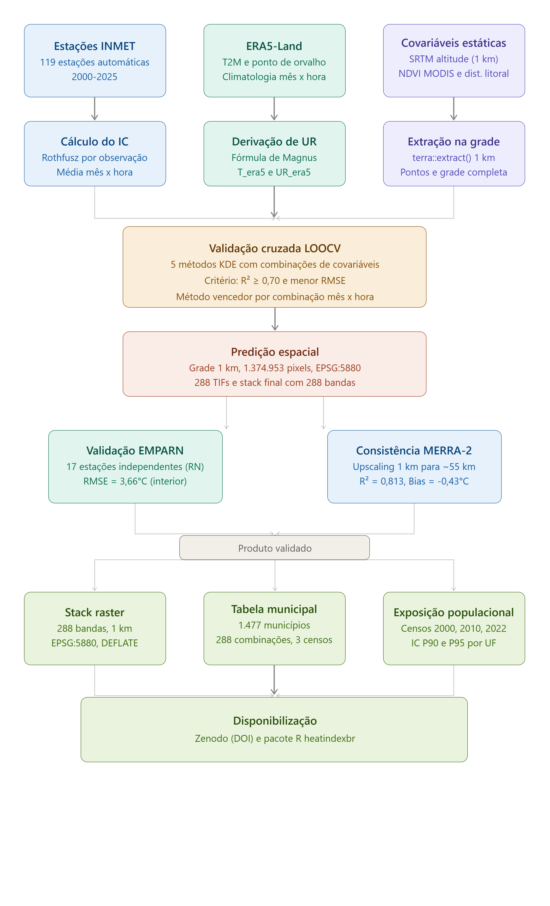
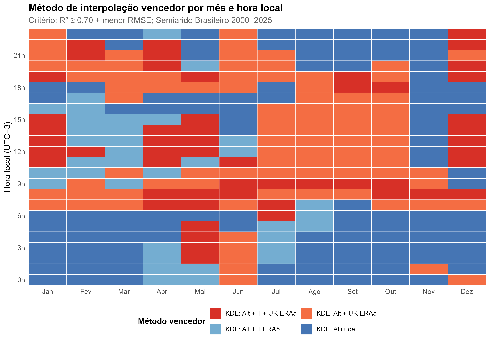

```{r, include = FALSE}
knitr::opts_chunk$set(collapse = TRUE, comment = "#>")
```

This article documents the interpolation methodology behind the Heat Index
climatology distributed by `heatindexbr` (v0.2.0). The goal is to give users
enough information to assess the data's fitness for their specific use case.
The original 2025 synoptic product (v0.1.0) remains documented at the end of
this article for reference.

---

## Pipeline overview

```{r, echo=FALSE, out.width="100%"}

```

Three independent data sources (INMET stations, ERA5-Land, and static
covariates) are processed in parallel and converge into the LOOCV validation
step. From there, the validated product branches into two independent
consistency checks before being packaged into three final products: the
raster stack, the municipal table, and the population exposure dataset, all
distributed via Zenodo and the `heatindexbr` package.

---

## The Heat Index

The Heat Index (IC) is computed using the Rothfusz (1990) regression
equation, which combines air temperature (T, degrees C) and relative
humidity (RH, percent) into a single thermal comfort index, building on the
foundational work of Steadman (1979) on human physiological response to heat
and humidity. Wind speed is not considered, which makes the index tractable
for regional-scale mapping where homogeneous wind data are unavailable.

---

## From synoptic hours to a full climatology

The package's main product is no longer limited to four synoptic hours. It
now provides a climatology covering all 12 months and all 24 UTC hours,
totaling 288 independent month times hour combinations, each representing
the 2000-2025 mean Heat Index for that specific moment of the daily and
annual cycle. This is a more robust estimate of typical thermal conditions
than any single year, and it allows users to examine the full diurnal and
seasonal cycle rather than four fixed snapshots.

Each of the 288 combinations was modeled and validated independently. There
is no single "best method" for the whole dataset, because the physical
process driving the Heat Index changes throughout the day, as detailed below.

---

## Input data

**Weather stations:** INMET automatic stations, climatological period
2000-2025. The validation network used 119 stations after applying data
completeness criteria.

**Covariates used in the best models:**

| Covariate | Source | Resolution |
|---|---|---|
| Altitude | SRTM | ~90 m |
| Air temperature (T) | INMET-derived covariate field | station-based |
| Relative humidity (UR) | INMET-derived covariate field | station-based |
| ERA5-Land T2m | Google Earth Engine export, climatological | ~9 km |

---

## Method comparison and the winning method per combination

Each of the 288 month times hour combinations was modeled using kriging
with external drift (KDE), testing combinations of altitude, temperature,
relative humidity, and ERA5-Land covariates. Random Forest was tested and
discarded for the full climatology for the same reason it was discarded in
the original 2025 analysis: block spatial cross-validation revealed spatial
leakage (delta R² = 0.082 between standard LOOCV and block CV), meaning the
model was partially memorizing station neighborhoods rather than learning
genuine spatial structure.

The winning method for each combination was selected using two criteria
applied in sequence: R² greater than or equal to 0.70, then lowest RMSE among
methods meeting that threshold. Four KDE variants compete across the 288
combinations:

- **KDE: Altitude**: altitude alone as external drift.
- **KDE: Alt + UR ERA5**: altitude plus relative humidity and ERA5-Land T2m.
- **KDE: Alt + T ERA5**: altitude plus air temperature and ERA5-Land T2m.
- **KDE: Alt + T + UR ERA5**: the full covariate set.

The heatmap below shows which method wins for each of the 288 combinations,
organized by month (columns) and local hour (rows, UTC-3).

```{r, echo=FALSE, out.width="100%"}

```

A clear physical pattern emerges. At night (00h to 06h local time), **KDE:
Altitude** alone wins almost everywhere: synoptic atmospheric forcing is weak
overnight, and local relief becomes the dominant control on temperature.
During the day (09h to 18h local time), methods incorporating **ERA5-Land
T2m** dominate: regional atmospheric forcing, captured by the reanalysis
product, becomes the stronger driver of spatial temperature variation than
relief alone. This transition is sharpest around sunrise and sunset, where
the method mix becomes more heterogeneous across months.

---

## Validation results

**LOOCV summary across all 288 combinations:**

| Statistic | Value |
|---|---|
| Mean R² | 0.778 |
| Mean RMSE | 1.12°C |
| Mean absolute error | approximately 0.85°C |
| Bias | near zero across all hours |
| Combinations below R² = 0.70 | 58 of 288 |

The 58 combinations that fall below the R² = 0.70 threshold are concentrated
in March through June, around 06h to 09h UTC. This period corresponds to the
transition between the rainy and dry seasons in the Semiarid, when atmospheric
conditions are more variable and harder to interpolate with the available
covariates. For these combinations, the method with the lowest RMSE was used
even though it did not reach the R² threshold, and each is flagged internally
with `atende_R2 = FALSE`. The `heatindexbr` package warns users automatically
when a requested month and hour combination falls in this range.

---

## Independent consistency check: MERRA-2 reanalysis

To assess whether the climatology is physically plausible beyond the INMET
station network used to build it, predicted Heat Index values were upscaled
from 1 km to approximately 55 km and compared against NASA's MERRA-2
reanalysis product, which is entirely independent of the interpolation model
and the station data.

```{r, echo=FALSE, out.width="100%"}
knitr::include_graphics("../figures/consistencia_merra2.png")
```

The comparison shows R² = 0.813 and Bias = -0.43°C. Because both products are
models rather than direct ground truth, RMSE and MAE are not reported here;
metrics that assume one side is the "true" value are not meaningful between
two independently modeled climatologies. The strong agreement at the upscaled
resolution supports the physical plausibility of the underlying 1 km
interpolation, independent of any single station network.

---

## Raster technical specifications

| Property | Value |
|---|---|
| File | `IC_288h_stack.tif` |
| Bands | 288 (12 months times 24 UTC hours, month-outer, hour-inner ordering) |
| CRS | EPSG:5880 (SIRGAS 2000 / Brazil Polyconic) |
| Resolution | ~1 km |
| Extent | Brazilian Semiarid (CONDEL/SUDENE 176/2024) |
| Temporal coverage | 2000-2025 climatology |
| Zenodo DOI | 10.5281/zenodo.21049066 |

Hours are stored in UTC. The `heatindexbr` package converts to local time
(UTC-3) automatically: `hour_local = (hour_utc - 3) %% 24`.

---

## Population exposure

The municipal table includes population data from the 2000, 2010, and 2022
IBGE Census, joined by normalized municipality name and state. Population
totals for the Brazilian Semiarid:

| Census year | Population |
|---|---|
| 2000 | 27,719,145 |
| 2010 | 29,975,455 |
| 2022 | 31,035,363 |

Using 2022 population weights, the mean Heat Index across the Semiarid is
25.9°C, with the 90th percentile at 31.6°C and the 95th percentile at 32.4°C.
The package applies a census-year convention when joining population to a
given time period: `pop_2000` for analyses before 2010, `pop_2010` for
2010-2021, and `pop_2022` for 2022 onward.

---

## Appendix: the 2025 synoptic product (v0.1.0)

The package's original product, still available via
`product = "synoptic_2025"`, provides annual mean Heat Index for the single
year 2025 at four synoptic hours (00h, 09h, 15h, 21h local time). It used a
simpler covariate set selected per hour: NDVI for nocturnal hours, capturing
local Caatinga land-surface processes, and ERA5-Land T2m for the 15h hour,
capturing daytime synoptic forcing. Validation against 59 to 73 INMET
stations (depending on hour) yielded R² = 0.884 and RMSE = 1.04°C at 15h, the
best-performing hour in that dataset.

This product remains useful for analyses specifically about the year 2025,
but the climatology described above is recommended for any application
concerned with typical or long-term thermal conditions.

---

## References

ROTHFUSZ, L. P. The heat index equation (or, more than you ever wanted to
know about heat index). NWS Technical Attachment SR 90-23. National Weather
Service, Fort Worth, TX, 1990.

STEADMAN, R. G. The assessment of sultriness. Part I: a temperature-humidity
index based on human physiology and clothing science. **Journal of Applied
Meteorology**, v. 18, n. 7, p. 861-873, 1979.

BRASIL. Resolução CONDEL/SUDENE n. 176, de 26 de março de 2024. Aprova a
delimitação do Semiárido Brasileiro. Superintendência do Desenvolvimento do
Nordeste, Recife, 2024. Disponível em:
<https://www.gov.br/sudene/pt-br/assuntos/superintendencia/semiarido>.
