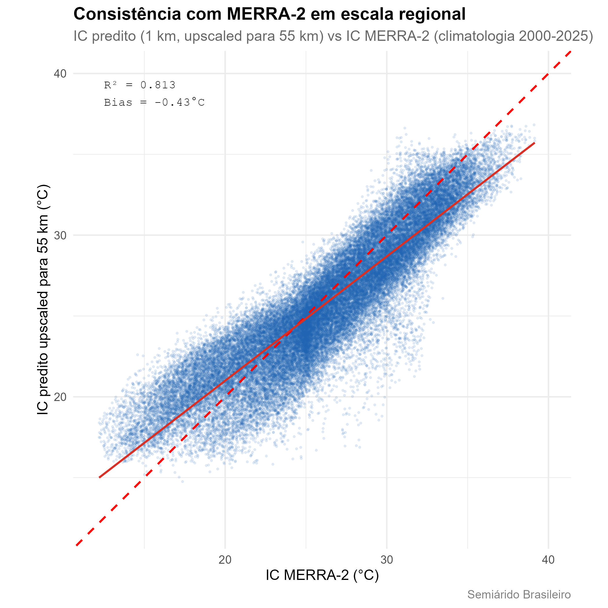

```{r, include = FALSE}
knitr::opts_chunk$set(collapse = TRUE, comment = "#>")
```

Este artigo documenta a metodologia de interpolação por trás da climatologia
do Índice de Calor distribuída pelo `heatindexbr` (v0.2.0). O objetivo é dar
aos usuários informação suficiente para avaliar a adequação dos dados ao seu
caso de uso específico. O produto sinótico original de 2025 (v0.1.0)
permanece documentado no final deste artigo para referência.

---

## Visão geral do pipeline

```{r, echo=FALSE, out.width="100%"}
knitr::include_graphics("fluxograma_metodologia.png")
```

Três fontes de dados independentes (estações INMET, ERA5-Land e covariáveis
estáticas) são processadas em paralelo e convergem para a etapa de validação
LOOCV. A partir daí, o produto validado se bifurca em duas verificações de
consistência independentes antes de ser empacotado em três produtos finais:
o stack raster, a tabela municipal e o conjunto de dados de exposição
populacional, todos disponibilizados via Zenodo e pelo pacote `heatindexbr`.

---

## O Índice de Calor

O Índice de Calor (IC) é calculado usando a equação de regressão de Rothfusz
(1990), que combina temperatura do ar (T, °C) e umidade relativa (UR, %) em
um único índice de conforto térmico, baseando-se no trabalho fundamental de
Steadman (1979) sobre a resposta fisiológica humana ao calor e à umidade. A
velocidade do vento não é considerada, o que torna o índice viável para
mapeamento em escala regional onde dados homogêneos de vento não estão
disponíveis.

---

## Dos horários sinóticos para uma climatologia completa

O produto principal do pacote não está mais limitado a quatro horários
sinóticos. Agora ele fornece uma climatologia cobrindo todos os 12 meses e
todas as 24 horas UTC, totalizando 288 combinações independentes de mês e
hora, cada uma representando o IC médio de 2000-2025 para aquele momento
específico do ciclo diário e anual. Essa é uma estimativa muito mais robusta
das condições térmicas típicas do que qualquer ano isolado, e permite que os
usuários examinem o ciclo diurno e sazonal completo em vez de quatro
instantâneos fixos.

Cada uma das 288 combinações foi modelada e validada de forma independente.
Não há um único "melhor método" para todo o conjunto de dados, pois o
processo físico que determina o Índice de Calor muda ao longo do dia, como
detalhado a seguir.

---

## Dados de entrada

**Estações meteorológicas:** estações automáticas do INMET, período
climatológico 2000-2025. A rede de validação usou 119 estações após aplicar
critérios de completude de dados.

**Covariáveis usadas nos melhores modelos:**

| Covariável | Fonte | Resolução |
|---|---|---|
| Altitude | SRTM | ~90 m |
| Temperatura do ar (T) | Campo de covariável derivado do INMET | por estação |
| Umidade relativa (UR) | Campo de covariável derivado do INMET | por estação |
| ERA5-Land T2m | Exportação climatológica via Google Earth Engine | ~9 km |

---

## Comparação de métodos e o método vencedor por combinação

Cada uma das 288 combinações de mês e hora foi modelada usando krigagem com
deriva externa (KDE), testando combinações de altitude, temperatura, umidade
relativa e covariáveis ERA5-Land. O Random Forest foi testado e descartado
para a climatologia completa pelo mesmo motivo da análise original de 2025: a
validação cruzada espacial por blocos revelou vazamento espacial (delta R² =
0,082 entre o LOOCV padrão e a CV por blocos), o que significa que o modelo
estava parcialmente memorizando a vizinhança das estações em vez de aprender
uma estrutura espacial genuína.

O método vencedor para cada combinação foi selecionado usando dois critérios
aplicados em sequência: R² maior ou igual a 0,70, depois menor RMSE entre os
métodos que atingem esse limiar. Quatro variantes de KDE competem entre as
288 combinações:

- **KDE: Altitude**: altitude isolada como deriva externa.
- **KDE: Alt + UR ERA5**: altitude mais umidade relativa e ERA5-Land T2m.
- **KDE: Alt + T ERA5**: altitude mais temperatura do ar e ERA5-Land T2m.
- **KDE: Alt + T + UR ERA5**: o conjunto completo de covariáveis.

O heatmap abaixo mostra qual método vence para cada uma das 288 combinações,
organizado por mês (colunas) e hora local (linhas, UTC-3).

```{r, echo=FALSE, out.width="100%"}
knitr::include_graphics("heatmap_metodos_288h.png")
```

Um padrão físico claro emerge. À noite (00h às 06h hora local), **KDE:
Altitude** isoladamente vence em quase todo o domínio: a forçante atmosférica
sinótica é fraca durante a noite, e o relevo local se torna o controle
dominante sobre a temperatura. Durante o dia (09h às 18h hora local), métodos
que incorporam **ERA5-Land T2m** dominam: a forçante atmosférica regional,
capturada pelo produto de reanálise, se torna o controle mais forte da
variação espacial de temperatura do que o relevo isolado. Essa transição é
mais acentuada por volta do nascer e do pôr do sol, onde a mistura de métodos
se torna mais heterogênea entre os meses.

---

## Resultados de validação

**Resumo do LOOCV nas 288 combinações:**

| Estatística | Valor |
|---|---|
| R² médio | 0,778 |
| RMSE médio | 1,12°C |
| Erro absoluto médio | aproximadamente 0,85°C |
| Bias | próximo de zero em todos os horários |
| Combinações abaixo de R² = 0,70 | 58 de 288 |

As 58 combinações abaixo do limiar de R² = 0,70 estão concentradas entre
março e junho, próximo de 06h a 09h UTC. Esse período corresponde à
transição entre a estação chuvosa e a seca no Semiárido, quando as condições
atmosféricas são mais variáveis e mais difíceis de interpolar com as
covariáveis disponíveis. Para essas combinações, o método de menor RMSE foi
usado mesmo sem atingir o limiar de R², e cada uma é sinalizada internamente
com `atende_R2 = FALSE`. O pacote `heatindexbr` avisa automaticamente o
usuário quando uma combinação de mês e hora solicitada cai nessa faixa.

---

## Verificação de consistência independente: reanálise MERRA-2

Para avaliar se a climatologia é fisicamente plausível além da rede de
estações INMET usada para construí-la, os valores preditos de Índice de
Calor foram upscaled de 1 km para aproximadamente 55 km e comparados com o
produto de reanálise MERRA-2 da NASA, que é totalmente independente do
modelo de interpolação e dos dados de estação.

```{r, echo=FALSE, out.width="100%"}

```

A comparação mostra R² = 0,813 e Bias = -0,43°C. Como ambos os produtos são
modelos, e não verdade de campo direta, RMSE e MAE não são reportados aqui;
métricas que assumem que um dos lados é o valor "verdadeiro" não fazem
sentido entre duas climatologias modeladas de forma independente. A forte
concordância na resolução upscaled reforça a plausibilidade física da
interpolação subjacente de 1 km, independentemente de qualquer rede de
estações específica.

---

## Especificações técnicas do raster

| Propriedade | Valor |
|---|---|
| Arquivo | `IC_288h_stack.tif` |
| Bandas | 288 (12 meses × 24 horas UTC, ordem mês-externo hora-interno) |
| CRS | EPSG:5880 (SIRGAS 2000 / Brazil Polyconic) |
| Resolução | ~1 km |
| Extensão | Semiárido Brasileiro (CONDEL/SUDENE 176/2024) |
| Cobertura temporal | climatologia 2000-2025 |
| DOI Zenodo | 10.5281/zenodo.21049066 |

As horas são armazenadas em UTC. O pacote `heatindexbr` converte para hora
local (UTC-3) automaticamente: `hora_local = (hora_utc - 3) %% 24`.

---

## Exposição populacional

A tabela municipal inclui dados de população dos Censos IBGE de 2000, 2010 e
2022, unidos por nome de município normalizado e estado. Totais de população
do Semiárido Brasileiro:

| Ano do censo | População |
|---|---|
| 2000 | 27.719.145 |
| 2010 | 29.975.455 |
| 2022 | 31.035.363 |

Usando os pesos populacionais de 2022, o IC médio no Semiárido é de 25,9°C,
com o percentil 90 em 31,6°C e o percentil 95 em 32,4°C. O pacote aplica uma
convenção de ano-censo ao unir população a um determinado período:
`pop_2000` para análises antes de 2010, `pop_2010` para 2010-2021, e
`pop_2022` para 2022 em diante.

---

## Apêndice: o produto sinótico de 2025 (v0.1.0)

O produto original do pacote, ainda disponível via
`product = "synoptic_2025"`, fornece o IC médio anual para o único ano de
2025 em quatro horários sinóticos (00h, 09h, 15h, 21h hora local). Usou um
conjunto de covariáveis mais simples, selecionado por horário: NDVI para
horários noturnos, capturando processos locais de superfície na Caatinga, e
ERA5-Land T2m para o horário das 15h, capturando a forçante sinótica diurna.
A validação contra 59 a 73 estações INMET (dependendo do horário) resultou em
R² = 0,884 e RMSE = 1,04°C às 15h, o melhor horário desse conjunto de dados.

Esse produto continua útil para análises especificamente sobre o ano de
2025, mas a climatologia descrita acima é recomendada para qualquer
aplicação preocupada com condições térmicas típicas ou de longo prazo.

---

## Referências

ROTHFUSZ, L. P. The heat index equation (or, more than you ever wanted to
know about heat index). NWS Technical Attachment SR 90-23. National Weather
Service, Fort Worth, TX, 1990.

STEADMAN, R. G. The assessment of sultriness. Part I: a temperature-humidity
index based on human physiology and clothing science. **Journal of Applied
Meteorology**, v. 18, n. 7, p. 861-873, 1979.

BRASIL. Resolução CONDEL/SUDENE n. 176, de 26 de março de 2024. Aprova a
delimitação do Semiárido Brasileiro. Superintendência do Desenvolvimento do
Nordeste, Recife, 2024. Disponível em:
<https://www.gov.br/sudene/pt-br/assuntos/superintendencia/semiarido>.
